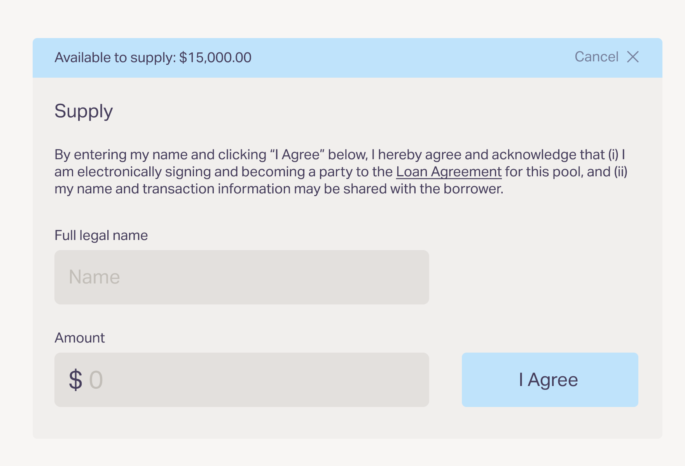

# Stage 4: Borrower Closing

Once all the setup for the Borrower Pool is done, it's time to open the borrower pool and close the fundraise. This happens in the below steps:

* **Open the Borrower Pool:** On the pre-agreed day, the Borrower pool will open for funding
* **Backer Funding:** Once the Borrower pool opens, Backers will be able to fund your Borrower Pool. They do so by:
* **Signing the Agreement + Funding -** Below is an image of the Agreement Signing and Funding interaction

Please note that the 'Loan Agreement' hyperlink above takes the Backer to a copy of the Loan Agreement that the Borrower provides.

* **Funding Complete:** Once the pool has been fully funded, the Borrower Pool will be locked
* **Borrower Executes the Agreement**: You will receive the details of the Backers who participated in your Borrower Pool. You will be responsible for appending their details to the loan agreement and executing the agreement.&#x20;
* **Creating a live dataroom:** You will be responsible for creating a live dataroom, and granting access to all Backers who participated in your Borrower Pool. In this dataroom you will upload:
  * The executed transaction agreements
  * Any relevant updates for the Backer community from time to time.
