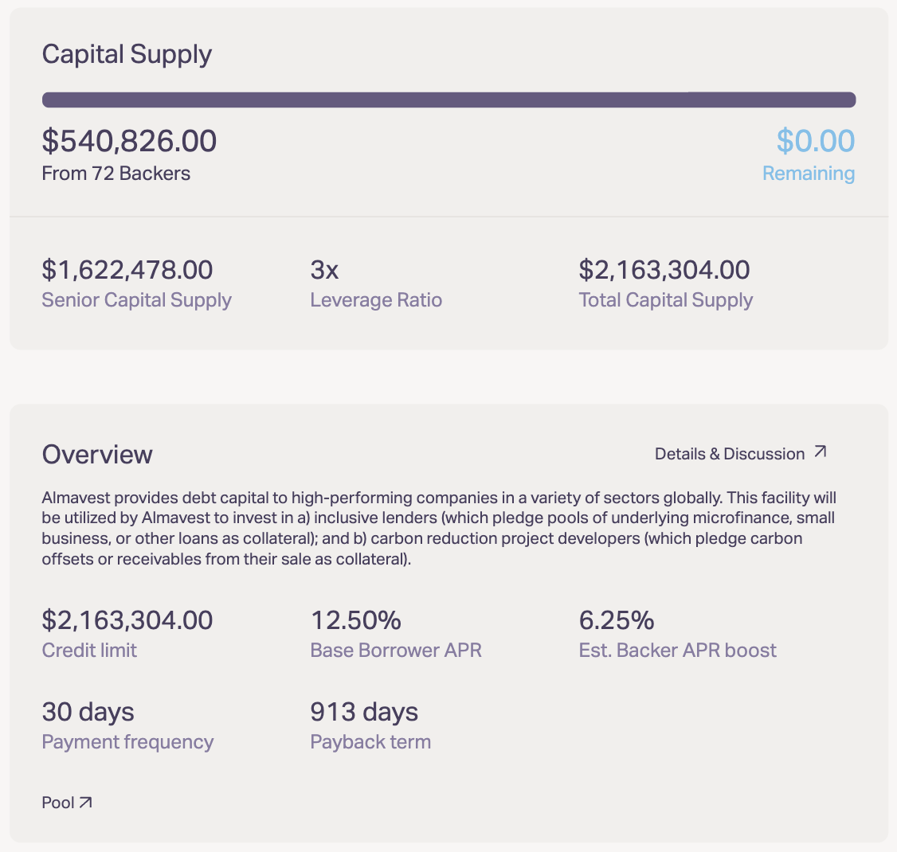
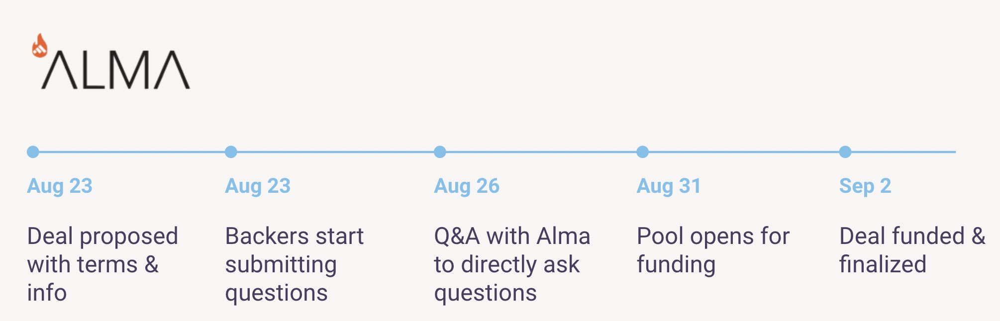

# Borrower Case Study

**Fund**: [**Almavest**](https://www.almavest.com/)

**Background**: Almavest is a credit fund that provides debt capital to fintech lenders, and carbon reduction project developers globally. In August 2021, Almavest launched a Borrower Pool on the protocol to raise \~$2M. The purpose of this Borrower Pool was to fund a basket of fintech lenders in the Global South.

**Process:** Over one week, the Almavest team underwent due diligence by the Backers, presenting them with a dataroom, and being on hand to answer questions posed by the Backers. This included a live video Q\&A session you can find [here](https://www.youtube.com/watch?v=urcnhuh-6to).

Once the due diligence period was done, the pool opened on August 31st for funding.

**Outcome:** The junior portion of the Borrower Pool was filled by 72 Backers, who provided $540,826. The Senior Pool provided an additional $1,622,478 (3x the Backer contribution) to complete the $2,163,304 raise. This entire process was completed in 30 minutes. Below is a screenshot from the Almavest Borrower Pool. You can find the live page [here](https://app.goldfinch.finance/pools/0xefeB69eDf6B6999B0e3f2Fa856a2aCf3bdEA4ab5).

#### Almavest Pool Snapshot

#### Almavest Timeline and Key Dates

* **Announce Investment to Community**
  1. Announce deal to backers with key timelines
* **Deal Proposed With Terms**
  1. Surface NDA, Dataroom, and Summary of Terms Backers are expected to review
* **Backers start submitting questions**
  1. Create a dedicated channel to accept and respond to questions through
* **Q\&A with Backers**
  1. Create a curated AMA session
* **Pool opens for funding**
  1. Confirm date you wish to open the pool for Backer funding
* **Deal funded & finalized**
  1. Drawdown capital into wallet, and wire to crypto business account to be converted to fiat ccy
  2. Post final docs up in dataroom for final selected investors
