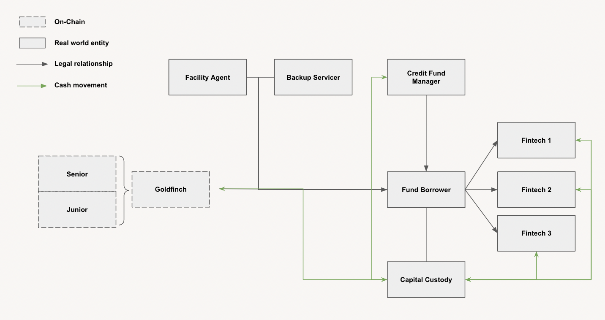
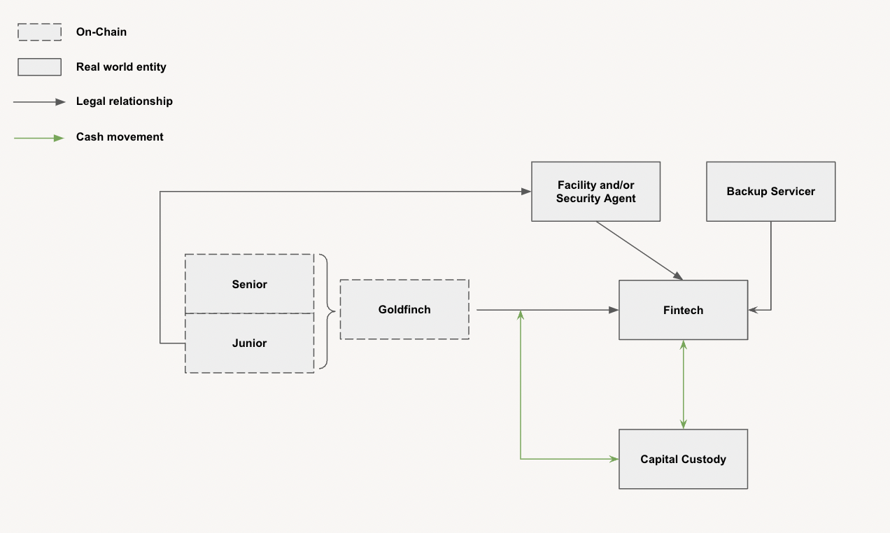

# Template Borrower Deal Structures

Here are a few simple archetypes of structures, Borrowers such as Credit Funds and Fintechs could design and propose to the Goldfinch community.

## Key Universal Structural Considerations

While there are many use cases for the Goldfinch ecosystem (see below), there are two universal questions which should be carefully considered prior to approaching the Goldfinch community.

1. "How will the transaction security which typically can be assigned to a single party in a transaction be perfected, and accessible to investors?"
2. "Who at the outset of pool close would be the primary delegate acting on the best interest of the other Backers when it comes to managing communications"

## Credit Funds

There are a multitude of use cases Credit Funds could deploy capital raised through the Goldfinch ecosystem into. The following illustrates just a few:

* Raise parri-passu or senior capital into your fund (or fund like) structure to then on-lend
* Co-invest into a new prospective borrower via raising new money capital
* Co-invest into an exiting borrower via raising new money capital (i.e. fill uncommitted allocation)
* Refinance existing investments via sub participate exiting investments at a different cost of capital

**Checklist of Features Credit Funds Could Incorporate**

* [ ] **Facility and Security Agent -** A single party appointed by the other Backers to manage the perfected security, and core communication between the Borrower and investor group
* [ ] **Backup Servicer** - A 3rd party with the ability to step in as the fund administrator in the instance the Credit Fund were to default
* [ ] **Capital Custody** - A capital custody platform(s) to manage Crypto or fiat capital

Template Deal StructuresHere are a few simple archetypes of structures, Borrowers such as Credit Funds and Fintechs could design and propose to the Goldfinch community.

## Key Universal Structural Considerations 

While there are many use cases for the Goldfinch ecosystem (see below), there are two universal questions which should be carefully considered prior to approaching the Goldfinch community.

1. 1."How will the transaction security which typically can be assigned to a single party in a transaction be perfected, and accessible to investors?"
2. 2."Who at the outset of pool close would be the primary delegate acting on the best interest of the other Backers when it comes to managing communications"

## Credit Funds 

There are a multitude of use cases Credit Funds could deploy capital raised through the Goldfinch ecosystem into. The following illustrates just a few:

* Raise parri-passu or senior capital into your fund (or fund like) structure to then on-lend
* Co-invest into a new prospective borrower via raising new money capital
* Co-invest into an exiting borrower via raising new money capital (i.e. fill uncommitted allocation)
* Refinance existing investments via sub participate exiting investments at a different cost of capital

**Checklist of Features Credit Funds Could Incorporate**

* **Facility and Security Agent -** A single party appointed by the other Backers to manage the perfected security, and core communication between the Borrower and investor group
* **Backup Servicer** - A 3rd party with the ability to step in as the fund administrator in the instance the Credit Fund were to default
* **Capital Custody** - A capital custody platform(s) to manage Crypto or fiat capital

## Fintech Structural Diagram 

The following is a potential "plug and play" structure speaking to the key universal structural considerations**Checklist of Features Fintechs Could Incorporate**

* [ ] **Facility and Security Agent -** A single party appointed by the other Backers to manage the perfected security, and core communication between the Borrower and investor group
* [ ] **Backup Servicer** - A 3rd party with the ability to step in to collect funds from the Fintechs end borrowers
* [ ] **Capital Custody** - A capital custody platform(s) to manage Crypto or fiat capital

