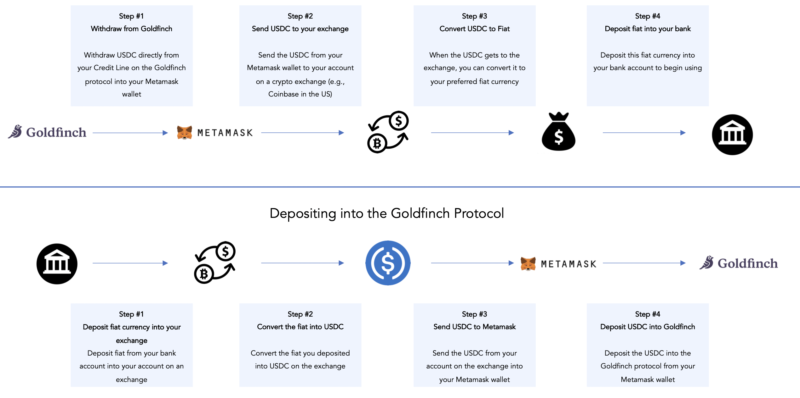

# Cash in and out of Goldfinch

As a Borrower (or Lead Backer) you will directly interact with the protocol by withdrawing and depositing USDC (a US dollar-backed stablecoin) into the protocol using your [Metamask](https://metamask.io/) wallet. Below is a diagram that explains your interaction with the protocol:&#x20;

Read on for a list of third-party service providers to help facilitate your movement from crypto to fiat and vice versa.&#x20;
