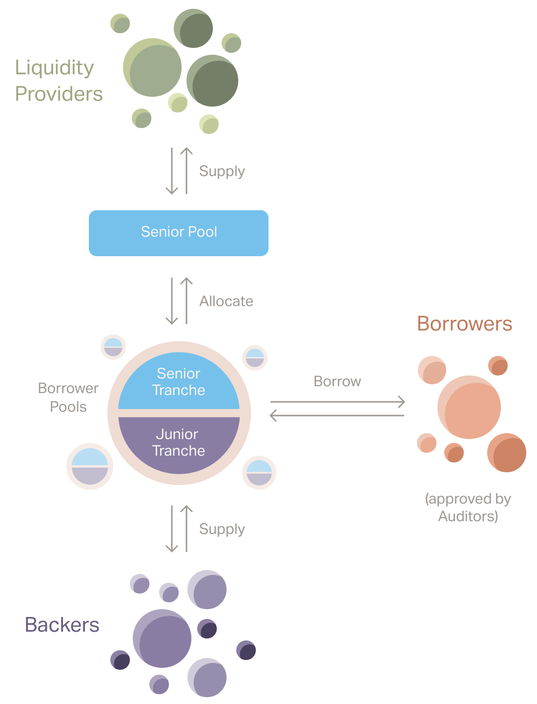

# Goldfinch Overview

_This overview is a condensed and accessible version of the_ [_Goldfinch Whitepaper Version 1.1_](https://goldfinch.finance/goldfinch\_whitepaper.pdf)_, published in July 2021, which provides the technical and in-depth explanation of the protocol’s foundations. You can learn about the below in more detail in the_ [_protocol mechanics section_](protocol-mechanics/) _of the documentation._

_For a deeper technical dive into Goldfinch’s code, smart contract configuration, security, and other technical features, view the_ [_Goldfinch Developer Documentation_](https://dev.goldfinch.finance/)_._

## **Goldfinch is a decentralized credit protocol that allows for crypto borrowing without crypto collateral—with loans instead fully collateralized off-chain.**

A core limitation of current decentralized crypto lending protocols is that they require borrowers to overcollateralize their loans with crypto assets, which prevents the vast majority of borrowers in the world from participating.

By incorporating the principle of “trust through consensus,” the Goldfinch protocol creates a way for borrowers to show creditworthiness based on the collective assessment of other participants rather than based on their crypto assets. Currently, all loans on the protocol are fully collateralized with off-chain assets and income.

## **Participants**

The Goldfinch protocol has three key roles: Investors, Borrowers, and Auditors. In addition, Members are Investors that have enhanced their participation to support the protocol’s growth. You can learn in more detail about these roles and their incentives (APYs, rewards, etc.) in the [protocol mechanics section](protocol-mechanics/) of the documentation.

**Investors** are participants who provide USDC to the protocol to be utilized by Borrowers. There are two ways to become an Investor on Goldfinch: as a Backer or as a Liquidity Provider.

* [_**Backers**_](protocol-mechanics/backers.md) optimize for yield and specificity. They assess individual Borrower Pools, decide whether to invest in them directly with first-loss capital, and earn the protocol’s highest yields for doing so.
* [_**Liquidity Providers**_](protocol-mechanics/liquidityproviders.md) optimize for diversification and liquidity. They supply second-loss capital to the Senior Pool, which automatically allocates its funds across all Borrower Pools according to the assessment of Backers.

****[**Members**](protocol-mechanics/membership.md) are participants who supply capital and GFI to a Goldfinch Membership Vault to support the network's growth and security, and receive Member Rewards for their enhanced participation.

****[**Borrowers**](protocol-mechanics/borrowers.md) are participants who seek financing from Goldfinch, and they propose Borrower Pools to be assessed by the network. Borrower Pools are smart contracts that contain the terms a Borrower seeks for their loan, such as the interest rate and repayment schedule.

****[**Auditors**](protocol-mechanics/auditors.md) vote to approve Borrowers, a required step before they can propose a Borrower Pool to Backers. Auditors are randomly selected by the protocol to provide a human-level check guarding against fraudulent activity and earn rewards in exchange for conducting this work. Note that as of June 2021 the Auditor role is not yet live on Goldfinch.

## **How Goldfinch works**

Borrowers (currently off-chain lending businesses) propose deal terms for credit lines (Borrower Pools) to the protocol. Goldfinch's community of Investors can then supply capital to these credit lines (Pools), either directly to individual Pools (as Backers) or indirectly by automatically allocating capital across the protocol (Liquidity Providers via the Senior Pool).

These Borrower businesses use their credit lines to draw down stablecoins, specifically USDC, from their Pool. Borrowers then exchange the USDC for fiat currency and deploy it on the ground to end-borrowers in their local markets.

In this way, the protocol provides the utility of crypto—specifically, its global access to capital—while leaving the actual end-borrower loan origination and servicing to the businesses best equipped to handle that in their own communities.

### Trust through consensus

In order to determine how to allocate capital from the Senior Pool, the protocol uses a principle of "trust through consensus." This means that while the protocol doesn't trust any individual Backer or Auditor, it does trust the collective actions of many of them.

At a high level: when more Backers supply to a given Borrower Pool, the Senior Pool [increases the ratio with which it adds leverage](protocol-mechanics/leveragemodel.md). Because this approach relies on counting individual Backers, the protocol must ensure they are in fact represented by different people. Therefore, all Backers, Borrowers, and Auditors require a "unique entity check" to participate (see below).

## **Junior and senior tranches**

Borrower Pool smart contracts have both a junior and senior tranche, which together account for 100% of a Borrower Pool’s capital. Backers supply capital to the Pools’ junior tranches, and the Senior Pool supplies capital to the Pools’ senior tranches.

When a Borrower makes repayments to one of their Borrower Pools, the Borrower Pool applies the payment first toward any interest and principal owed to the senior tranche at that time, and then toward any interest and principal owed to the junior tranche at that time.

This is to ensure an alignment of incentives. Backers, who actively assess the viability of individual Borrower Pools, take on the protocol’s highest risk by providing first-loss capital via junior tranches. This incentivizes Backers to do an adequate job of assessing the viability of the Pools, as they will be the first to miss repayment in the case of a default.

Liquidity Providers, who provide capital to the Senior Pool that is automatically allocated across Borrower Pools according to the actions of Backers, take on less risk by providing second-loss capital via senior tranches. This provides Liquidity Providers with the added security of knowing that they will be the first repaid if a Pool that was evaluated positively by Backers does go into default.

To track the different amounts that investors supply, Backers receive an NFT representing their deposit when they supply capital. The NFT tracks the amount that was supplied and how much of it has been redeemed. This allows the protocol to ensure that no one redeems for more than their proportional share of the total repayments as they come in.

Senior Pool LPs receive FIDU, an ERC-20 token representing their position that grows in USDC exchange value as interest and repayments are made to the Senior Pool.

At any time, a Backer can use their NFT to redeem their specific portion of the available repayments in the Pool. Senior Pool Liquidity Providers can withdraw their position in the Senior Pool at any time by depositing their FIDU to a [Withdrawal Request](https://docs.goldfinch.finance/goldfinch/protocol-mechanics/liquidity).

## **Tokens**

There are two native tokens on Goldfinch: GFI and FIDU. Both follow the ERC20 standard. In addition, the protocol utilizes stablecoins, currently only [USDC](https://www.circle.com/en/usdc), for investment and loans.&#x20;

**GFI** is Goldfinch’s core native token. GFI is used for governance voting, Auditor staking, Auditor vote rewards, community grants, staking on Backers, protocol incentives, and can be deposited into a Member Vault to earn Member Rewards in exchange for helping to secure the protocol’s growth.

**FIDU** is a token that represents a Liquidity Provider’s deposit to the Senior Pool. When a Liquidity Provider supplies to the Senior Pool, they receive an equivalent amount of FIDU. FIDU can be redeemed for USDC in the Goldfinch dapp at an exchange rate based on the net asset value of the Senior Pool, minus a 0.5% withdrawal fee. The exchange rate for FIDU increases over time as interest payments are made back to the Senior Pool.

## **Key Borrower repayment incentives**

* Because Borrowers need to publicize their wallet address when proposing pools to Backers, their on-chain history becomes public to future creditors—even those off-chain. As more of global finance moves on-chain, creating a negative on-chain credit history is comparable for future credit opportunities to creating a negative off-chain credit score or record.
* Borrowers will likely want to continue borrowing from Goldfinch. The moment they are late on any payment, Borrowers are unable to borrow further from any Borrower Pool.
* While not explicitly supported by the protocol, Backers may form off-chain legal agreements with Borrowers, including requiring Borrowers to collateralize their on-chain loan with off-chain collateral. Backers may require such an agreement to be in effect, either with them directly or with another Backer, in order to be willing to supply capital. In these cases, the legal agreement and potential Investor recourse are another important incentive for Borrowers. Currently, all loans on Goldfinch are fully collateralized with off-chain assets via this mechanism.
* While occasional defaults are common across finance, Backers will likely stop supplying more capital to any of a Borrower’s pools if the Borrower is consistently late on repayments. It is up to Backer to evaluate whether Borrowers are qualified and have a good enough track record to garner Backer investment in any future pools the Borrower proposes.

## **Governance**

Goldfinch is a decentralized, community-driven and community-managed protocol. Governance is managed by the community DAO and has the ability to perform maintenance functions and parameter adjustments via governance votes, including:

* Upgrading contracts
* Changing protocol configurations and parameters
* Selecting Unique Entity Check providers
* Setting rewards and the distribution of GFI
* Pausing protocol activity in the event of an emergency

## **Unique Entity Check**

Since the protocol relies on “trust through consensus,” it is critical to avoid [Sybil Attacks](https://en.wikipedia.org/wiki/Sybil\_attack) by having confidence that each Borrower, Backer, and Auditor is a unique entity. Therefore, they must each be verified with a “Unique Entity Check” before they can participate.

Governance approves the protocol’s Unique Entity Check providers. Currently, this is solved by [Unique Identity (UID)](unique-identity-uid/), the world’s first NFT for identity verification.

UID is a non-transferrable NFT representing Know-Your-Customer (KYC), Know-Your-Business (KYB), and/or U.S. investor accreditation verification on-chain. It follows ERC-1155 standards, and is freely usable by any other protocol. No personally identifiable data is stored on-chain. UID is a product developed by Warbler Labs, the core development team supporting Goldfinch’s growth.&#x20;

At any time the Goldfinch community can use the governance process to update or change how the Unique Entity Check is being conducted, such as by introducing oracles that perform off-chain checks to validate that the wallet addresses are unique entities.

## **Ready to learn more?**

This brief overview is only intended to provide a baseline understanding of Goldfinch and how it functions. To learn about the above in more detail, along with additional information on incentives and rewards, fraud resistance, the Leverage Model that determines Senior Pool allocation, and more, read on through the [Protocol Mechanics sections](protocol-mechanics/).
