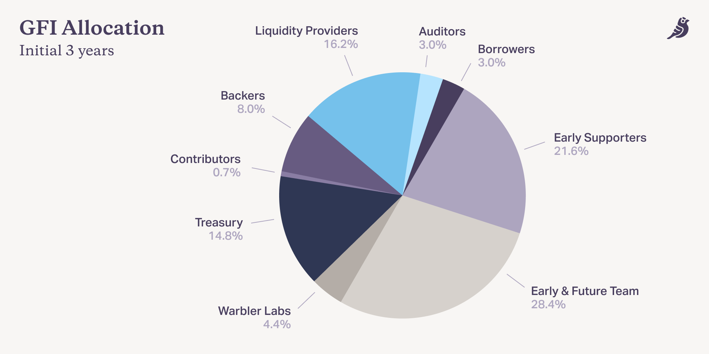

# Tokenomics

## Total Token Supply&#x20;

The initial token supply is capped at **114,285,714 GFI tokens**.&#x20;

There is currently no inflation, but it is expected that it will be beneficial for the protocol to incorporate modest inflation after 3 years in order to reward future active participants. Ultimately, this will be up to the community to discuss and decide.

## Token Allocations&#x20;

The initial allocation of the total supply of GFI are as follows:

### **Liquidity Providers** (16.2%)&#x20;

4.2% — Early Liquidity Provider Program: These tokens are allocated to the early Liquidity Provider program, which incentivized the very first participants to supply capital to the protocol. This program closed in July 2021. These allocations unlock over 6 months beginning on January 11, 2022, with a 12-month transfer restriction for U.S. participants.

4.0% — Retroactive Liquidity Provider Distribution: These tokens are allocated to all 5,157 liquidity providers as of a Dec 14 snapshot, excluding the Early Liquidity Provider program above. These distributions are only to non-U.S. persons and unlock over a range of immediate to 12 months, depending on the contribution amount and earliest contribution date.

8.0% — Senior Pool Liquidity Mining: These tokens are allocated to ongoing liquidity mining, beginning immediately. Senior Pool liquidity mining is described in the [Liquidity Mining](../protocol-mechanics/investor-incentives/senior-pool-liquidity-mining.md) section.

### Backers (8.0%)&#x20;

3.0% — Flight Academy: These tokens are allocated to the 10,182 non-U.S. participants in Flight Academy. 2.85% are distributed [according to the tiers described in this post](https://goldfinchfinance.notion.site/Flight-Academy-Rewards-Update-05aeb437087c4eee90f00523897f1ef6), with an unlock schedule ranging from immediate to 24 months. The remaining 0.15% are allocated to future participants.

2.0% — Backer Pool Liquidity Mining: The Backer Pool liquidity mining system grants tokens to Backers as interest payments are made into Borrower pools, and the system is now in place, following a  [governance proposal](https://snapshot.org/#/goldfinch.eth/proposal/0xb716c18c38eb1828044aca84a1466ac08221a37a96ce73b04e9caa847e13e0da). There have also been retroactive distributions for existing Backers who have already supplied to Borrower pools as well – [this proposal](https://snapshot.org/#/goldfinch.eth/proposal/0xb716c18c38eb1828044aca84a1466ac08221a37a96ce73b04e9caa847e13e0da) has more details.

3.0% — Backer Staking: These tokens are allocated for Backers who stake GFI on other backers, as described in the [whitepaper](https://goldfinch.finance/goldfinch\_whitepaper.pdf). This is not yet live, but the community is expected to introduce and vote on a proposal for this in the coming months.

### Auditors (3.0%)&#x20;

3.0% of tokens are set aside for auditors, for any future auditor system launched by the protocol through decentralized community governance. An auditor system is not yet live, but we expect the community to introduce and vote on a proposal for one in the coming months.&#x20;

### Borrowers (3.0%)&#x20;

3.0% of tokens are set aside for Borrowers, for when and if the community decides to implement a future distribution system for Borrowers.

### Contributors (0.65%)&#x20;

0.65% is allocated to contributors who have already significantly contributed to the community and protocol, either through a management role in the community Discord, by creating great art or memes, or through contracting agreements with the Foundation. Contributors who participated in Flight Academy will receive Flight Academy rewards as part of this category. These distributions generally follow the same unlock schedule as the Flight Academy distributions.

### Community Treasury (14.8%)&#x20;

14.8% is allocated to the community’s treasury, which the community can decide to use for purposes such as grants to developers and contributors, adjustments to protocol distribution mechanics, and coverage for potential loan defaults.

### Early and Future Team (28.4%)&#x20;

28.4% is allocated to the early Goldfinch team of 25+ employees, advisors, and contractors. Full-time contributors are subject to 4 or 6 year unlock schedules, and part-time contributors are subject to 3-year unlock schedules, all with initial 6-month lock-ups and 12-month transfer restrictions.

### Warbler Labs (4.4%)&#x20;

4.4% is allocated to Warbler Labs, a separate organization spun out from the early Goldfinch team that will contribute to the Goldfinch community and broader DeFi ecosystem. The tokens are subject to a 3-year unlock schedule with an initial 6-month lock-up and 12-month transfer restriction.

### Early Supporters (21.6%)&#x20;

21.6% is allocated to a group of 60+ early supporters who invested $37M to help build the protocol. These supporters are all long-term oriented and have 3-year unlock schedules, as well as an initial 6-month lock-up and 12-month transfer restriction.
